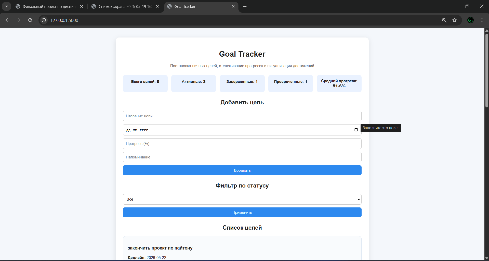
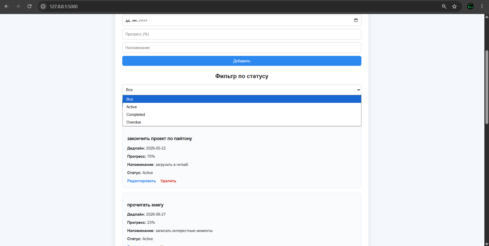
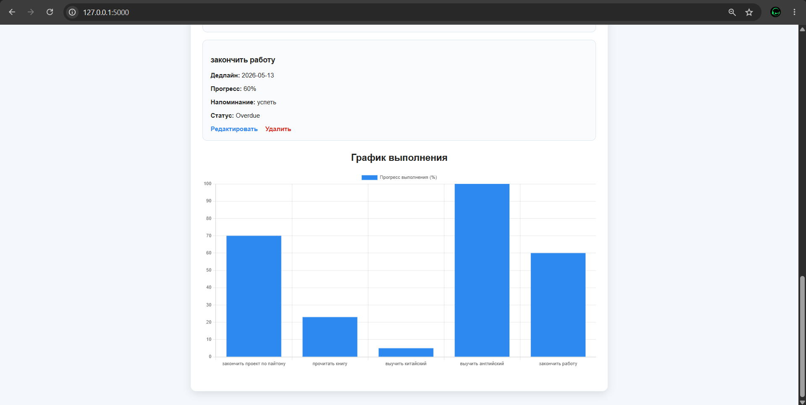
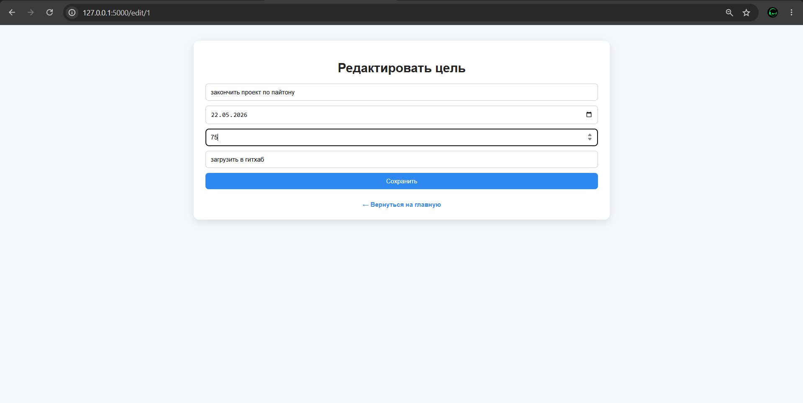

# Goal Tracker

# Описание проекта
Goal Tracker: веб приложение на Flask для постановки личных целей, отслеживания прогресса и визуализации достижений

# Реализованные функции
- Добавление новой цели
- Указание дедлайна
- Указание прогресса в процентах
- Добавление напоминания
- Редактирование и удаление целей
- Автоматическое определение статуса: Active, Completed, Overdue
- Фильтрация целей по статусу
- Валидация данных формы
- График выполнения через Chart.js
- Хранение данных в JSON-файле

# Структура проекта
goal_tracker/
    app.py
    requirements.txt
    README.md
    data/
        goals.json
    static/
        style.css
    templates/
        index.html
        edit.html

# Установка и запуск
1. Откройте проект в VS Code.
2. Откройте терминал в папке проекта.
3. Установите зависимости:
pip install -r requirements.txt
4. Запустите приложение:
python app.py
5. Откройте в браузере адрес:
http://127.0.0.1:5000/

# Используемые технологии
- Python
- Flask
- HTML
- CSS
- Chart.js
- JSON

# screenshots

